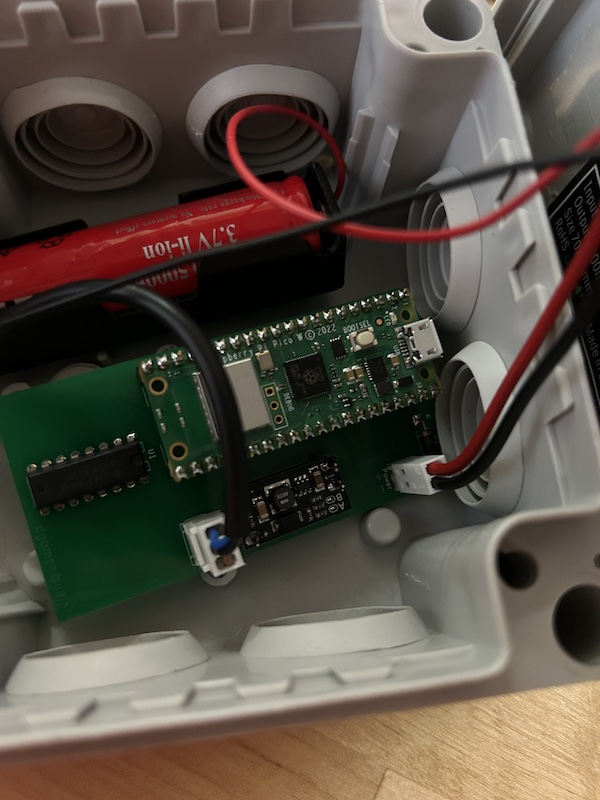

# Water Meter Sensor


This project enables you to monitor the water usage of your house hold water usage through the use of a DIY water meter sensor built using:

- [Raspberry Pi Pico W](https://www.raspberrypi.com/documentation/microcontrollers/raspberry-pi-pico.html)
- [Inductive Proximity Sensor Detection Switch - TL-W5MC1](https://www.aliexpress.com/item/32973109912.html)
- [TI High-Speed CMOS Logic 14-Stage Binary Counter](https://www.ti.com/lit/ds/symlink/cd54hc4020.pdf)

The RPI Pico W is very flexible in terms of power requirements, but in my case I use:

- 18650 Battery
- [18650 TP4056 Lithium Battery Charger Module With Protection](https://www.aliexpress.com/item/32930640893.html)
- [Mini Boost Module Step Up Board 5V](https://www.aliexpress.com/item/4000626913742.html) (to power the Inductive Proximity Sensor which states minimum 6V but actually works with 5V)

Just assemble everything :)




You can find the PCB source files (KiCAD) in the respective directory. (`Water Meter PCB`)

I designed an 3d printed adapter for the Inductive Proximity Sensor.  (`3Dadapter directory`)

The RPi Pico W is flashed with a micropython firmware and then you upload the all project available in `src`

You must have an MQTT broker (e.g. Mosquitto)

The project automatically integrates with [Home Assistant](https://www.home-assistant.io)

# config.py

You will need to create an additional file called `config.py` that must include the variables:

```python
SSID = "myhome_network"
WIFI_PASSWORD = "blablabla" 

SERVER = "192.168.1.1"  #this is your MQTT Broker Address

```
